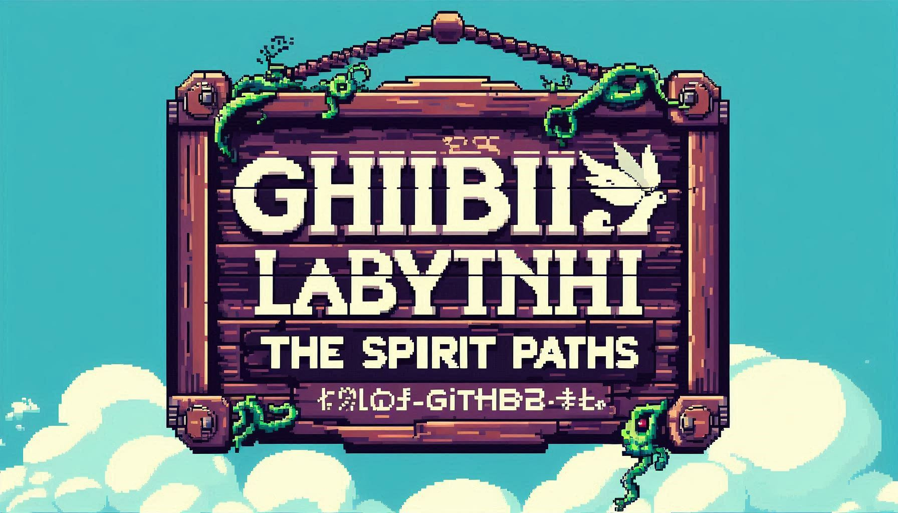

# Ghibli Labyrinth: The Spirit Paths


## Description
Ghibli Labyrinth: The Spirit Paths is a fan-made multiplayer escape labyrinth game inspired by the enchanting worlds of Studio Ghibli. This project is created by fans for fans, aiming to capture the magic and artistry of Ghibli's storytelling.

## Features
- **Multiplayer Gameplay**: Team up with friends to navigate through intricate mazes.
- **Ghibli-inspired Themes**: Experience environments and characters reminiscent of beloved Ghibli films.
- **Escape Mechanics**: Pick up iconics objects and find your way out of the labyrinth.

## Installation
As the game is developed in Unity, it has been created a build with the executable program of the game (.exe archive in the file). It's possible to download it at the following link using the given code:

   **MEGA link with the entering code**:
   ```bash
   https://mega.nz/folder/v34y0IxQ
   ```
   ```bash
   1oYCpuZGDFnqnnKIPQj6pQ
   ```
   
## Usage
A basic guide has been included within the game to guide players on how to navigate and enjoy the experience.

## Contributing
I am new to open-source contributions, but if anyone is interested in helping out, please feel free to reach out, and I will consider any contributions!

## License
This project is a student project and is based on Ghibli's intellectual property. As such, no official license has been assigned. Please be mindful of copyright considerations.

## Contact
For any inquiries or suggestions, you can contact me at: [hernandezanalaura376@gmail.com](mailto:hernandezanalaura376@gmail.com). You can also reach out via GitHub if you prefer.
